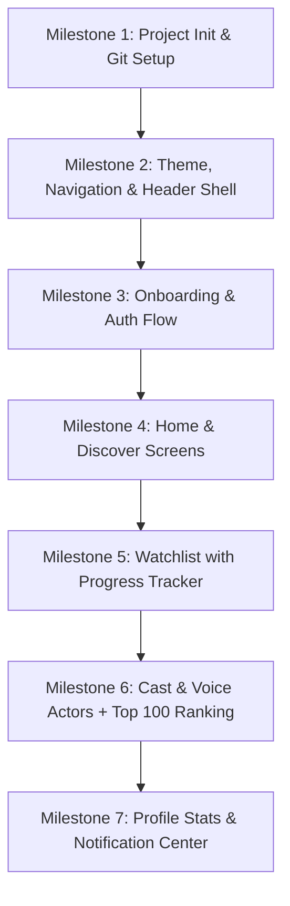

# Episoda Mobile App Implementation Plan

We will build the **Episoda** cross-platform mobile application (iOS & Android) using **React Native + Expo + TypeScript**, styled faithfully to match your 12 Figma screens.

---

## User Review Required

> [!IMPORTANT]
> **Tech Stack Selection: Expo + React Native + TypeScript**
> - **Expo** allows instant live previewing on both your physical **iPhone** (via Expo Go app) and **Android** phone without needing a Mac/Xcode for development on Windows.
> - **Git & GitHub Desktop**: We will initialize Git immediately in your project root so that after each milestone increment, you can open GitHub Desktop, see all changes clearly, and commit them with humanized commit messages and descriptions.

---

## Architecture & Design Specifications

### 1. Color Palette & Theme Tokens
- **Background Tint**: `#E8F8F5` (Soft Mint / Light Seafoam)
- **Primary Teal / Accents**: `#00BFA5` / `#00A884`
- **Dark Green (Headers & Text)**: `#0D3831` / `#112211`
- **Card Background**: `#FFFFFF` with `#00BFA5` border outlines (signature Episoda style)
- **Status Tags**: Dark green badges and progress indicators

### 2. Screen Inventory (12 Figma Prototypes)
1. **Launch / Splash**: Animated Episoda Soda Can logo and tagline.
2. **Onboarding Carousel (3 screens)**:
   - Slide 1: Popular & Trending shows / Cast & Voice actors.
   - Slide 2: Progress tracker / never lose track.
   - Slide 3: Manage watchlist & binge sessions + "Get Started" button.
3. **Authentication**: Sign In / Sign Up form with Remember Me, Forgot Password, and OAuth buttons (Google, Apple, Facebook).
4. **Header (Global Overlay)**: Torii gate profile avatar (left), Episoda brand logo (center), Notification bell (right).
5. **Main 5-Tab Navigation**:
   - **Tab 1 - Home**: 2-column grid of trending TV series & anime with poster borders.
   - **Tab 2 - Watchlist**: Sections for *Watching*, *Planning*, and *Completed* with interactive episode count counters (`780/∞`, `3/8`, `9/10`, etc.).
   - **Tab 3 - Discover**: Real-time search with filter chips (*TV*, *Anime*, *ONA*) and seasonal show cards.
   - **Tab 4 - Cast & Voice Actors**: Split comparison cards (Character portrait + Voice Actor portrait, names, and verification checkmarks).
   - **Tab 5 - Ranking (Top 100)**: Numbered leaderboard cards with category filters.
6. **Profile Modal / Screen**: Avatar, user info table, and 3×3 Watch Statistics grid (Anime/TV/Total hours and episodes).
7. **Notification Screen**: Chronological episode airing alerts with show tags and relative timestamps.

---

## Proposed Incremental Milestones

Each milestone will be delivered with:
- Clean, modular TypeScript code
- Verification on Expo dev server
- **Humanized Git commit message** and **bulleted description** ready for GitHub Desktop.

---

## Verification Plan

### Manual Verification
1. **Local Bundler**: Run `npx expo start` and verify bundle builds cleanly with zero TypeScript or bundling errors.
2. **Mobile Device Verification**: Scan the QR code using the **Expo Go** app on your iPhone and Android device to verify responsive layout, notch/Dynamic Island safe area handling, and smooth navigation.
3. **GitHub Desktop Verification**: Verify that repository changes appear cleanly grouped in GitHub Desktop after each increment.
