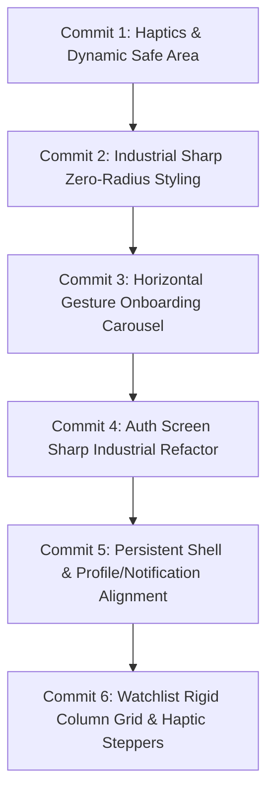

# Implementation Plan 2: Complete UI/UX Polish & Figma Fidelity

This plan details the systematic, one-commit-per-issue process to eliminate all design discrepancies, improve mobile UX, and achieve 100% pixel-perfect fidelity with the 12 Figma prototype screens.

---

## Identified Issues & Systematic Milestones

---

### Step 1: Haptic Feedback & Safe Area Insets (Commit 1)
- **Problem**: No physical tactile feedback when tapping buttons, tabs, or incrementing episodes; fixed padding can clip on different phone notches and home bars.
- **Solution**:
  - Install `expo-haptics`.
  - Create `src/utils/haptics.ts` (light, selection, medium, success feedback).
  - Apply `useSafeAreaInsets` dynamically in `App.tsx` and header components.

### Step 2: Industrial Sharp Styling & Exact Figma Outlines (Commit 2)
- **Problem**: Some cards and search inputs had rounded corners (`borderRadius: 8`, `16`, `24`) that softened the design and drifted from Figma's sharp 90° boxy anime/cyberpunk aesthetic.
- **Solution**:
  - Update `src/constants/theme.ts` with explicit radius tokens (`none: 0`, `sharp: 2`).
  - Refactor `MediaCard.tsx`, `RankingCard.tsx`, `CastCard.tsx`, `SearchInput.tsx`, and `FilterTabs.tsx` to use sharp 90° corners, exact 2.5px `#00BFA5` borders, and glowing cyan `#00F5D4` rank labels.

### Step 3: Gesture-Driven Paginated Onboarding Carousel (Commit 3)
- **Problem**: Onboarding currently relies on a static tap button rather than a natural mobile swipe gesture.
- **Solution**:
  - Refactor `src/screens/OnboardingScreen.tsx` with a native horizontal `FlatList` (`pagingEnabled={true}`, `showsHorizontalScrollIndicator={false}`).
  - Dynamic indicator dots reflecting scroll progress.
  - High-fidelity vector illustrations matching Figma (Netflix 'N', checklist/progress card, couch with 3D popcorn).
  - "Get Started" black pill button with `#00BFA5` border on the final slide.

### Step 4: Auth Screen Sharp Industrial Refactor (Commit 4)
- **Problem**: Form inputs and social buttons had rounded borders and missing sign-up field transitions.
- **Solution**:
  - Refactor `src/screens/AuthScreen.tsx` to sharp zero-radius rectangular inputs with `#00BFA5` 2px outlines.
  - Sharp rectangular social login buttons (Facebook royal blue, Google white, Apple black with teal borders).
  - Thick `#00BFA5` horizontal divider bar and input validation.

### Step 5: Screen Lifecycle & Profile / Notification Shell (Commit 5)
- **Problem**: Profile and Notifications previously removed the bottom navigation and replaced the global header.
- **Solution**:
  - Align `src/screens/ProfileScreen.tsx` and `src/screens/NotificationScreen.tsx` with Figma Screens 11 & 12 (top header and bottom tabs remain accessible).
  - Perfect 4-row Profile user info box with solid dark green borders and white background.
  - Perfect 3×3 Statistics grid with bold teal numbers (`#00A884`) and centered labels.
  - Format Notifications with underlined teal show titles (`Episode 1115 of <u>One Piece</u> aired!`), relative timestamps, and unread badges.

### Step 6: Watchlist Rigid Column Grid & Haptic Steppers (Commit 6)
- **Problem**: Episode counters and media badges lacked rigid grid column constraints, causing slight text shifts.
- **Solution**:
  - Refactor `src/components/WatchlistRow.tsx` and `src/screens/WatchlistScreen.tsx` with fixed-width column alignment: Thumbnail (44x44), Title (flex), Steppers (+/-), Progress (`780/∞`), Type badge (`Anime`/`TV`/`ONA`).
  - Wire light haptic feedback on every `+` and `-` press.
  - Trigger success haptic and status auto-transition to *Completed* when reaching total episodes.

---

## Verification Plan

### Automated & Build Verification
1. **TypeScript Typecheck**: `npx tsc --noEmit` with 0 errors after each commit.
2. **Hermes Bundle Export**: `npx expo export --dump-sourcemap=false --no-minify` verification for both iOS and Android.

### Manual Verification
1. **Swipe Testing**: Test horizontal swipe navigation on Onboarding carousel.
2. **Visual Fidelity Check**: Compare each updated screen side-by-side with the 12 Figma screenshot files in `DesktopItems\Episoda`.
3. **Tactile Haptic Feedback**: Verify physical vibration response on iPhone and Android for tab switches and watchlist steppers.
