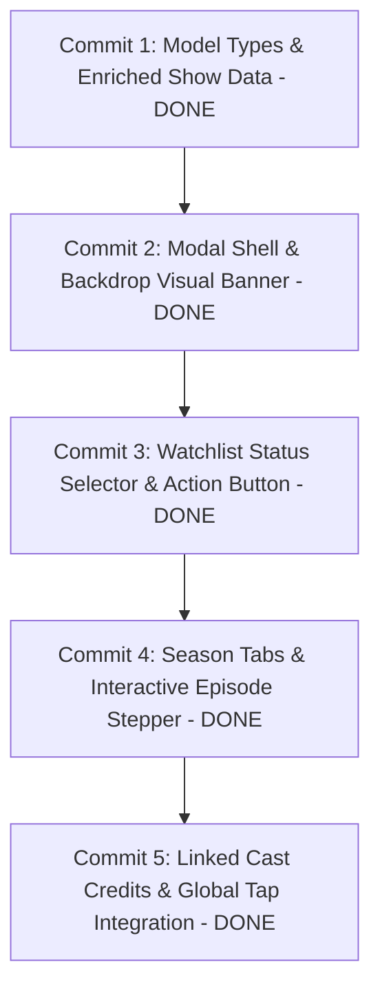

# Implementation Plan 3: Show Details Modal & Episode Stepper

This plan details the step-by-step implementation of the Show Details Modal and interactive Episode Stepper, bridging card browsing with full media tracking and episode management.

---

## 5 Incremental Steps (One Commit Per Increment)

---

### Step 1: Model Types & Enriched Show Data (Commit 1)
- **Problem**: Shows currently only have basic titles and total episode numbers, lacking backdrop artwork, synopsis, genres, and individual episode lists needed for a detailed view.
- **Solution**:
  - Update `src/types/index.ts` with `EpisodeItem` and enriched `Show` interface (`backdropUrl`, `genres`, `year`, `status`, `episodes`).
  - Enrich `src/data/mockData.ts` with realistic synopses, backdrop photos, and episode lists for all major shows (*The Boys*, *One Piece*, *Peaky Blinders*, *Attack on Titan*, *Stranger Things*, *Chernobyl*, *Demon Slayer*).

### Step 2: Modal Shell & Backdrop Visual Banner (Commit 2)
- **Problem**: Tapping a media card currently has no destination.
- **Solution**:
  - Add `selectedShow: Show | null`, `openShowDetails(show: Show)`, and `closeShowDetails()` to `AppContext`.
  - Create `src/components/ShowDetailsModal.tsx` rendered as a sleek modal with:
    - High-resolution backdrop image with `LinearGradient` darkening overlay.
    - Top floating close button (`✕`) with safe-area clearance.
    - Prominent Chakra Petch bold title, release year, star rating badge (`★ 8.9`), and media type badge (`TV`/`Anime`/`ONA`).
    - Expandable synopsis text with genre tags.
  - Connect `MediaCard` and `RankingCard` on Home and Ranking screens to open the modal.

### Step 3: Watchlist Status Selector & Action Button (Commit 3)
- **Problem**: Users need a direct way to add a show to their watchlist or change its category (*Watching*, *Planning*, *Completed*) from the details view.
- **Solution**:
  - Implement dynamic action bar in `ShowDetailsModal.tsx`:
    - When not in watchlist: **"+ Add to Watchlist"** (black fill with `#00BFA5` border).
    - When in watchlist: Displays current status pill with quick modal selector to toggle between *Watching*, *Planning*, and *Completed*.
    - Option to remove from watchlist.
  - Full AsyncStorage persistence and haptic feedback.

### Step 4: Season Tabs & Interactive Episode Stepper (Commit 4)
- **Problem**: Users want to mark individual episodes as watched, see episode titles, and track season progression.
- **Solution**:
  - Implement Season switcher tabs (S1, S2, S3...) for multi-season TV shows.
  - Display episode list:
    - Episode number (`EP 1`, `EP 2`), title, and checkmark toggle button.
    - Tapping an episode toggles its watched status and updates the global watchlist progress.
    - Top progress bar showing `X / Total` watched with percentage fill.
    - Success haptic feedback when completing all episodes.

### Step 5: Linked Cast Credits & Global Tap Integration (Commit 5)
- **Problem**: Cast members are currently only browsable on the Cast tab, not linked directly to their respective shows.
- **Solution**:
  - Add horizontal Cast & Voice Actors carousel in `ShowDetailsModal.tsx` filtered to the current show's characters and actors.
  - Connect tap handlers across all screens:
    - **Home Screen**: Tapping any of the 10 featured shows opens details.
    - **Discover Screen**: Tapping any search result or season card opens details.
    - **Ranking Screen**: Tapping any Top 100 card opens details.
    - **Watchlist Screen**: Tapping any row opens details.

---

## Verification Plan

### Automated & Build Verification
1. **TypeScript Typecheck**: `npx tsc --noEmit` after every commit (0 errors).
2. **Multi-Platform Bundling**: `npx expo export --dump-sourcemap=false --no-minify` verification for iOS, Android, and Web.

### Manual Verification
1. **Modal Presentation**: Open and close details modal from Home, Discover, Ranking, and Watchlist.
2. **Episode Stepper Testing**: Toggle episodes, verify top progress bar updates, and verify watchlist sync.
3. **Watchlist Category Changes**: Move a show between *Watching*, *Planning*, and *Completed* and verify instant reflection in the Watchlist tab.
