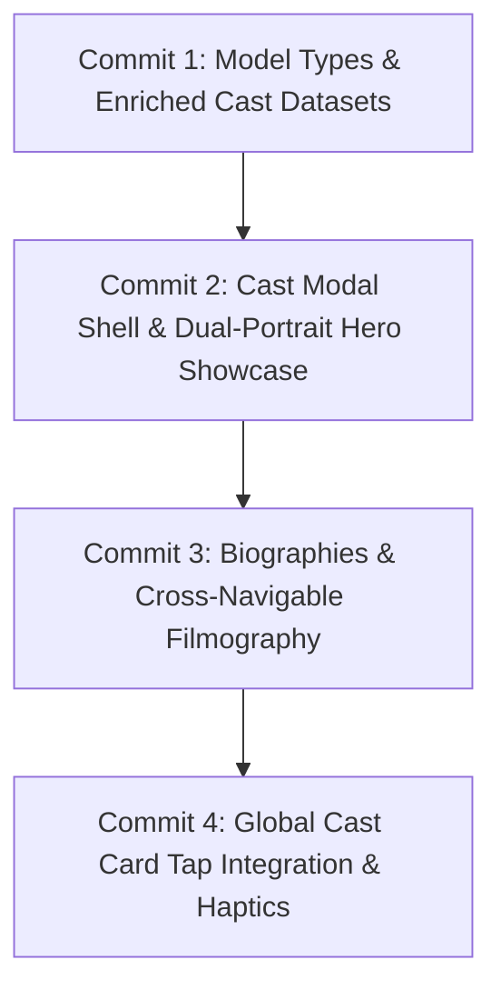

# Implementation Plan 4: Cast Member Details Modal & Actor Filmography

This plan details the step-by-step implementation of the Cast Member Details Modal and Actor Filmography, bringing dedicated character/voice actor spotlights, rich biographies, and cross-navigable filmographies into Episoda.

---

## 4 Incremental Steps (One Commit Per Increment)

---

### Step 1: Model Types & Enriched Cast Datasets (Commit 1)
- **Problem**: `CastMember` currently only has minimal fields (`characterName`, `actorName`, `showTitle`, image URLs), lacking biographies, roles, and other known credits.
- **Solution**:
  - Update `src/types/index.ts` with `FilmographyItem` interface and extended `CastMember` properties (`actorBio`, `characterBio`, `role`, `nationality`, `birthDate`, `filmography`).
  - Enrich `INITIAL_CAST_MEMBERS` in `src/data/mockData.ts` with authentic actor bios, character descriptions, and filmographies (e.g. Zack Aguilar -> Tanjiro in *Demon Slayer* and David in *Cyberpunk: Edgerunners*; Karl Urban -> Billy Butcher in *The Boys* and Eomer in *Lord of the Rings*; Mayumi Tanaka -> Luffy in *One Piece* and Krillin in *Dragon Ball*).

### Step 2: Cast Modal Shell & Dual-Portrait Hero Showcase (Commit 2)
- **Problem**: There is no dedicated view or state management for inspecting cast member details.
- **Solution**:
  - Add `selectedCastMember: CastMember | null`, `openCastDetails(member: CastMember)`, and `closeCastDetails()` to `AppContext.tsx`.
  - Create `src/components/CastDetailsModal.tsx` featuring:
    - Dual-portrait hero showcase displaying character portrait and actor portrait side-by-side with sharp teal divider and borders.
    - Floating circular close button (X) with safe-area insets.
    - Large Chakra Petch bold actor name and verified checkmark badge (`#10B981`).
    - Character badge ("Voicing [Character] in [Show]"), nationality tag, and role type chip.
  - Mount `CastDetailsModal` in `App.tsx`.

### Step 3: Biographies & Cross-Navigable Filmography (Commit 3)
- **Problem**: Users want to read character backstories, actor bios, and see what other shows the actor has participated in.
- **Solution**:
  - Add segmented/stacked Biography section in `CastDetailsModal.tsx` for Character Bio and Actor Bio.
  - Build horizontal / list "KNOWN FOR / FILMOGRAPHY" section:
    - Displays cards with poster artwork, character voiced, show title, and release year.
    - Tapping a show in the filmography cross-navigates to `openShowDetails(matchingShow)`.

### Step 4: Global Cast Card Tap Integration & Haptics (Commit 4)
- **Problem**: Tapping cast cards on the Cast tab or within Show Details does nothing.
- **Solution**:
  - Add `onPress?: () => void` prop to `CastCard.tsx` and wrap in tactile `TouchableOpacity`.
  - Connect cast card press in `src/screens/CastScreen.tsx` to `openCastDetails(member)`.
  - Connect cast card press in `src/components/ShowDetailsModal.tsx` carousel to `openCastDetails(member)`.
  - Run full TypeScript type check and multi-platform bundle validation (`npx expo export`).

---

## Verification Plan

### Automated & Build Verification
1. **TypeScript Typecheck**: `npx tsc --noEmit` after every step (0 errors).
2. **Multi-Platform Bundling**: `npx expo export --dump-sourcemap=false --no-minify` verification for iOS, Android, and Web.

### Manual Verification
1. **Modal Presentation**: Tap cast cards on Cast Screen and Show Details Modal to verify smooth opening and closing.
2. **Cross-Navigation**: Tap a show in an actor's filmography to verify seamless transition into the Show Details Modal.
3. **Responsive Design**: Verify safe-area handling on top close button and edge-to-edge scrolling.
